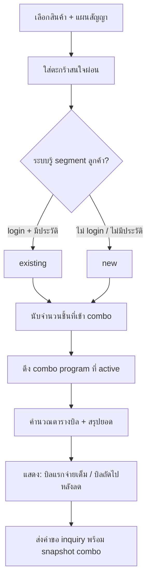

# Combo Discount Flow (ส่วนลดซื้อหลายชิ้น / ลูกค้าใหม่–เก่า)

เอกสารนี้ล็อก flow ระบบ **Combo** สำหรับ LG Subscribe — ส่วนลดเพิ่มเมื่อลูกค้าสมัคร/ผ่อนหลายชิ้นในคำสั่งเดียวกัน

> **ไม่สับสนกับ `sale_type = combo` บน `product_plans`** — ตัดออกแล้วใน migration `0024` (แผนสัญญารองรับเฉพาะ `subscription`)  
> ระบบในเอกสารนี้ = **โปรแกรมส่วนลดระดับคำสั่ง (order-level)** ตั้งค่าจากแอดมิน แล้วคำนวณทับราคาจาก `plan_billing_tiers`

อ้างอิงราคาฐาน: [SUBSCRIPTION_PLAN_FLOW.md](./SUBSCRIPTION_PLAN_FLOW.md)

---

## 0) บันทึกการตัดสินใจ (Decision log)

| วันที่ | ข้อตกลง |
|---|---|
| 2026-06-01 | เริ่มออกแบบ Combo แยกจากแผนสัญญา — เป็น **campaign / rule engine** ไม่ใช่ `sale_type` ต่อ SKU |
| 2026-06-01 | แยกกลุ่มลูกค้า **ลูกค้าใหม่** vs **ลูกค้าเก่า** — อัตราส่วนลดต่อจำนวนชิ้นอาจต่างกัน |
| 2026-06-01 | ส่วนลดตาม **จำนวนชิ้นในคำสั่ง** เช่น 1 ชิ้น = ลดเพิ่ม X%, 2 ชิ้น = ลดเพิ่ม Y% |
| 2026-06-01 | คำนวณจาก **ยอดผ่อนรายเดือนตาม tiers ของแต่ละแผน** แล้วลด % ตาม combo แล้ว **รวมยอดทั้งสัญญา** |
| 2026-06-01 | **เดือนแรก (บิลแรก) ยังชำระยอดผ่อนตามราคาเดิม** — ส่วนลด combo **เลื่อนไปมีผลตั้งแต่บิลที่ 2** (ส่วนลดที่ “ควรได้” ในเดือนแรกไปอยู่เดือนที่ 2) |
| 2026-06-01 | **Phase C1 shipped:** ตาราง `combo_programs` / `combo_program_tiers` + แอดมินตั้งค่า (กฎบิล 2 / defer_rate / ทุกสินค้า = คงที่ในโค้ด) |
| 2026-06-01 | **ค่าคงที่ระบบ (ไม่ให้แอดมินแก้):** บิล combo มีผล = **2** · โหมด = **defer_rate** · สินค้า = **ทุก SKU ที่ publish** |

---

## 1) ปัญหาที่ต้องแก้

| วันนี้ | ต้องการ |
|---|---|
| ตะกร้าสนใจผ่อนรวมราคาแต่ละแผน ไม่มีส่วนลดหลายชิ้น | ลูกค้าเลือก 2 SKU → ได้ส่วนลด combo เพิ่มตามที่แอดมินกำหนด |
| ไม่แยกลูกค้าใหม่/เก่า | กฎต่างกันตาม segment |
| ราคาแสดงบนเว็บ = ราคา plan เท่านั้น | หน้าตะกร้า / สรุปคำขอต้องแสดง **ราคาหลัง combo** และอธิบายว่าบิลแรกยังจ่ายเต็ม |

---

## 2) คำศัพท์ (Domain)

| คำ | ความหมาย |
|---|---|
| **Combo program** | ชุดกฎส่วนลด (ช่วงวันที่, กลุ่มลูกค้า, จำนวนชิ้น, % ลด) ที่แอดมินตั้งค่า |
| **Customer segment** | `new` = ลูกค้าใหม่ · `existing` = ลูกค้าเก่า (นิยามต้องล็อก — ดู §8) |
| **Item count tier** | จำนวนชิ้นในคำสั่งที่นับร่วม combo เช่น 1 ชิ้น / 2 ชิ้น |
| **Extra discount %** | ส่วนลดเพิ่มจาก combo **ทับ** ราคา/เดือนของแผน (ไม่แทนที่ tier โปรใน PDF) |
| **Base installment** | ราคา/เดือนของบิลนั้นจาก `plan_billing_tiers` (ก่อน combo) |
| **Combo-adjusted installment** | ราคา/เดือนหลังใช้ % combo (เมื่อบิลนั้นอยู่ในช่วงที่ combo มีผล) |
| **Discount deferral** | บิลแรกยังเก็บ base — ส่วนลด combo เริ่มมีผล/สะสมตั้งแต่บิลที่ 2 |

---

## 3) กฎธุรกิจ (จาก requirement ล่าสุด)

### 3.1 กลุ่มลูกค้า + จำนวนชิ้น

แอดมินกำหนดตารางประมาณนี้ (ตัวอย่าง — ตัวเลขจริงมาจากหลังบ้าน):

| Segment | จำนวนชิ้นในคำสั่ง | ส่วนลดเพิ่ม (combo) |
|---|---|---|
| ลูกค้าใหม่ | 1 | X% |
| ลูกค้าใหม่ | 2 | Y% |
| ลูกค้าเก่า | 1 | X′% |
| ลูกค้าเก่า | 2 | Y′% |

- นับเฉพาะสินค้า/แผนที่ **อยู่ใน scope ของโปรแกรม** (เช่น SKU ที่ผูก campaign หรือทั้งหมด — ดู §6)
- ถ้ามีมากกว่า 2 ชิ้น: กำหนด tier สูงสุดหรือไม่รองรับ — **open**

### 3.2 วิธีคำนวณยอดผ่อน

1. แต่ละรายการในตะกร้า → มี `product_plans` + `plan_billing_tiers` อยู่แล้ว
2. สร้างตารางบิลรายเดือน **ต่อรายการ** (บิล 1..N ตาม `contract_months`)
3. หา **combo %** จาก segment + จำนวนชิ้นที่นับได้
4. ต่อบิล `b` ของแต่ละรายการ (ให้ `base(b)` = ราคาแผนงวดนั้น, `pct` = combo %):
   - **บิล 1** → ชำระ `base(1)` เต็ม (ยังไม่หัก combo)
   - **บิล 2** → ชำระ `base(2) − round(pct% × base(1)) − round(pct% × base(2))` (ส่วนลดรวมในงวดนี้ = % ของงวดแรกที่เลื่อนมา + % ของงวดที่ 2)
   - **บิล 3+** → ชำระ `base(b) − round(pct% × base(b))` (หักเฉพาะ % ของงวดนั้น)
5. **รวมยอดทั้งคำสั่ง** = ผลรวมทุกบิลทุกรายการ (+ มัดจำ `advance_amount` ต่อแผน ถ้ามี — มัดจำลดหรือไม่ **open**)

**ตัวอย่างตัวเลข (1 รายการ, combo 10%, ผ่อน 500/เดือนคงที่):**

| บิล | base | ส่วนลด | ชำระ |
|---|---|---|---|
| 1 | 500 | — | 500 |
| 2 | 500 | 50 (10% งวด 1) + 50 (10% งวด 2) = 100 | **400** |
| 3+ | 500 | 50 (10% งวดนั้น) | 450 |

> ประโยค requirement: *“ส่วนลดในเดือนแรก จะไปอยู่ในเดือนที่ 2”* — แปลเป็น **`combo_effective_from_bill = 2`**: บิล 1 เก็บเต็ม, ตั้งแต่บิล 2 ใช้ราคาหลังลด (หรือถ้าต้องการ “เครดิตส่วนต่างบิล 1 ไปหักบิล 2” ให้เลือกโหมดใน §4.2)

### 3.3 ความสัมพันธ์กับช่วงบิลโปร (เช่น บิล 1–4 ลด 5% ใน PDF)

- ราคา **base** ของแต่ละบิลมาจาก **tier ของแผน** อยู่แล้ว (เช่น บิล 1–6 = 149, บิล 7–60 = 799)
- Combo % ใช้ทับ **base ของบิลนั้น** ในบิลที่ combo มีผล
- บิลที่อยู่ในช่วง “เดือนแรกยังจ่ายเดิม” = **บิลที่ 1** ของ combo (ไม่ใช่ทั้ง 4 บิลแรกของ tier) — ค่า `COMBO_EFFECTIVE_FROM_BILL = 2` คงที่ในโค้ด

---

## 4) โหมดคำนวณ (ล็อกแล้ว)

ใช้ **`defer_rate`** (เลื่อนส่วนลดงวด 1 ไปรวมในงวด 2) — ค่าคงที่ใน `shared/utils/comboProgramDisplay.ts`

```
b = 1  → charged = base(1)
b = 2  → charged = base(2) − round(pct%×base(1)) − round(pct%×base(2))
b ≥ 3  → charged = base(b) − round(pct%×base(b))
```

- บิล 1: จ่ายเต็มตาม tier แผน
- บิล 2: ส่วนลดรวม = **% ของงวดแรก + % ของงวดที่ 2** (ไม่ใช่แค่ base×0.9)
- บิล 3+: หัก % ของงวดนั้นอย่างเดียว

---

## 5) Flow ผู้ใช้ (Storefront)



### สิ่งที่ต้องแสดงบนตะกร้า / หน้าส่งคำขอ

- จำนวนชิ้นที่ได้ combo + % ที่ใช้
- ตารางหรือสรุป: **บิลที่ 1 รวมเท่าไร** · **บิลที่ 2+ ประมาณเท่าไร**
- ยอดรวมตลอดสัญญาหลัง combo (เทียบกับก่อนลด)
- ข้อความ: ส่วนลด combo มีผลตั้งแต่บิลที่ 2 (หรือตามที่ตั้งค่า)

---

## 6) Backend / Admin (ร่าง schema)

### 6.1 ตารางหลัก (ร่าง)

```sql
-- โปรแกรม combo หนึ่งชุด (migration 0029)
combo_programs (
  id, name, status, starts_at, ends_at,
  customer_segment,  -- 'new' | 'existing'
  is_active, notes,
  created_at, updated_at
)

-- ส่วนลดตามจำนวนชิ้น (ต่อ program)
combo_program_tiers (
  program_id,
  min_items int,      -- เช่น 1, 2
  max_items int null, -- null = ไม่จำกัดบน
  extra_discount_percent numeric not null
)
```

**ไม่เก็บใน DB (คงที่ใน `shared/utils/comboProgramDisplay.ts`):**

- `COMBO_EFFECTIVE_FROM_BILL = 2`
- `COMBO_DISCOUNT_MODE = 'defer_rate'`
- scope สินค้า = ทุกสินค้า `published`

### 6.2 API (ร่าง)

| Method | Path | ใช้ทำ |
|---|---|---|
| GET | `/api/admin/combo-programs` | รายการโปรแกรม |
| POST/PATCH | `/api/admin/combo-programs/[id]` | สร้าง/แก้ + tiers |
| POST | `/api/public/combo/quote` | body: `{ items: [{product_id, plan_id}], customer_segment? }` → ตารางบิล + ยอดรวม |
| — | ฝังใน cart composable | เรียก quote เมื่อตะกร้าเปลี่ยน |

### 6.3 ฟังก์ชันคำนวณ (shared)

```ts
// shared/utils/comboPricing.ts (ยังไม่ implement)

type ComboQuoteInput = {
  segment: 'new' | 'existing'
  items: InquiryItem[]  // snapshot แผน + tiers
  program: ComboProgram
}

type ComboQuoteResult = {
  tier_applied: { min_items: number, percent: number }
  per_item: Array<{
    product_id: string
    bills: Array<{ bill: number, base: number, charged: number, combo_applied: boolean }>
    contract_total_base: number
    contract_total_charged: number
  }>
  order_total_base: number
  order_total_charged: number
  first_bill_total: number
  summary_lines: string[]  // สำหรับ UI
}
```

---

## 7) Inquiry / หลังบ้าน

- เก็บ **snapshot combo** ใน `subscription_inquiries` (`combo_snapshot` + `combo_customer_segment`) — คำนวณฝั่ง server ตอนส่งคำขอ (migration `0031`)
- แอดมินดูคำขอ: แสดง % combo, segment, ตารางบิลก่อน/หลัง
- Line summary: บรรทัดส่วนลด combo + ยอดรวมหลังลด

---

## 8) Open questions (ต้อง confirm ก่อน code)

1. **นิยามลูกค้าใหม่ vs เก่า** — ไม่เคย subscribe / ไม่เคย inquiry / ไม่มี `customer_id` / หมดอายุเกิน N เดือน?
2. **มากกว่า 2 ชิ้น** — มี tier 3 ชิ้นไหม หรือใช้ tier สูงสุด (2 ชิ้น)?
3. **มัดจำ (`advance_amount`)** — ลดด้วย combo % หรือไม่?
4. ~~**โหมดคำนวณ**~~ → ล็อก `defer_rate`
5. ~~**`combo_effective_from_bill`**~~ → ล็อก `2`
6. ~~**สินค้าใน scope**~~ → ทุกสินค้า publish (ไม่มีตาราง scope)
7. **ซ้อนกับ promotion หน้าเว็บ** (`promotions`) — ใช้ร่วมกันได้ไหม?
8. **ปัดเศษ** — ปัดทศนิยมรายบิล / รายเดือน อย่างไร (0.01 บาท)?
9. **ลูกค้า guest** — ถือเป็น `new` เสมอจนกว่า login?

(ข้อ 4–6 ปิดแล้ว — ล็อกในโค้ด)

---

## 9) Phase แนะนำ

| Phase | ขอบเขต |
|---|---|
| **C1 — Spec + DB** | ✅ migration `0029_combo_programs` + `/api/admin/combo-programs` + `/admin/combo-programs` |
| **C2 — Engine** | `comboPricing.ts` + `POST /api/public/combo/quote` |
| **C3 — Storefront** | ตะกร้า + สรุปค่าใช้จ่าย + inquiry snapshot |
| **C4 — Polish** | segment detection, รายงานแอดมิน, ทดสอบ edge cases |

---

## 10) ความสัมพันธ์กับระบบเดิม

| ระบบ | ความสัมพันธ์ |
|---|---|
| `product_plans` + `plan_billing_tiers` | ราคา **ฐาน** ก่อน combo |
| `InterestCostSummary` / `orderDueToday` | ต้องขยายให้แยก “บิล 1 ตาม combo rule” vs “หลัง combo” |
| `promotions` | โปรโมชั่นการตลาด (banner/landing) — คนละชั้นกับ combo pricing |
| `SUBSCRIPTION_PLAN_FLOW.md` | อัปเดต open question #3 → ชี้มาที่เอกสารนี้ |

---

*อัปเดตล่าสุด: 2026-06-01 — ร่างจาก requirement ทีม (ลูกค้าใหม่/เก่า, 1–2 ชิ้น, % ลด, เลื่อนส่วนลดบิลแรกไปบิล 2)*
