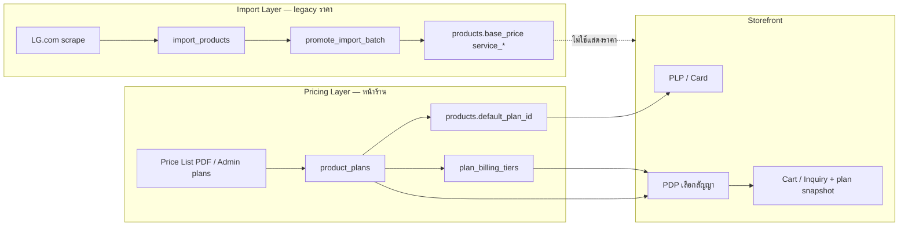

# Subscription Plan Flow (สัญญา / Policy / ราคาหลายช่วง)

เอกสารนี้ล็อก flow การทำ **แผนสัญญา (Plan)** ต่อ SKU ให้ตรงกับ Price List ภายใน เช่น `public/pdf/Price list_June 2026.pdf`

> อ้างอิงโครงสร้างตาราง PDF: แบบการขาย · รุ่น · **รายการสัญญา** · ระยะเวลารอบบริการ · ราคาปกติ/โปร · **ราคาต่อเดือน (หลายช่วงบิล)** · **Policy**

---

## 0) บันทึกการตัดสินใจ (Decision log)

| วันที่ | ข้อตกลง |
|---|---|
| 2026-06-01 | แสดงผล **ยอดสุทธิ** = รวมค่างวดจาก tiers + มัดจำล่วงหน้า |
| 2026-06-01 | เพิ่มหมายเหตุมัดจำ `advance_note` เพื่อส่งไปแสดงหน้า website (เช่น “มัดจำล่วงหน้า 10 เดือน”) |
| 2026-06-01 | **ไม่ต้องกรอกรายการสัญญา (`contract_label`)** — ระบบ generate อัตโนมัติจาก `contract_years + service_mode` |
| 2026-06-01 | ถอดการใช้งาน `service_self_clean`, `service_technician`, `service_months`, `installment_months` ออกจาก UI หลักแล้ว (คง `warranty_years`) เพื่อไม่ให้ชนกับแผนสัญญา |
| 2026-06-01 | Audit `products`: ยัง **ลบคอลัมน์ราคา legacy ไม่ได้** เพราะใช้กับ import/admin; คอลัมน์ที่แทบไม่ถูกอ่านฝั่งหน้าร้านตอนนี้คือ `discount_percent`, `price_range`, `default_plan_id` (รอ Phase 2) |
| 2026-06-01 | **ตัด Override ราคารวมออก** — ราคารวมคำนวณจาก tiers เท่านั้น |
| 2026-06-01 | **รองรับมัดจำล่วงหน้าเป็นตัวเลข (`advance_amount`)** สำหรับสินค้าที่มีเงินมัดจำ |
| 2026-06-01 | **Policy code ไม่บังคับกรอก** (optional) |
| 2026-06-01 | **ราคาโปร (PDF) ไม่ต้องกรอก** — ให้ระบบคำนวณราคารวมจากบิลรายเดือน (tiers) |
| 2026-06-01 | **ตัดระบบ `outright` และ `combo` ออกจากแผนสัญญา** — รองรับเฉพาะ `subscription` เท่านั้น |
| 2026-06-01 | **Combo ส่วนลดหลายชิ้น** — ออกแบบแยกใน [COMBO_DISCOUNT_FLOW.md](./COMBO_DISCOUNT_FLOW.md) (ไม่ใช่ `sale_type` บน plan) |
| 2026-05-29 | **ราคาแบบเดิม (`products.base_price` ฯลฯ) ใช้แสดงหน้าเว็บหลักไม่ได้แล้ว** — PDF มีหลายสัญญา/หลายช่วงบิลต่อ SKU |
| 2026-05-29 | **ราคาเก่าลบออกจาก DB ไม่ได้** — LG.com import + `import_products` + `promote_import_batch` ยัง sync `base_price`, `discount_*`, `service_*` อยู่ ถ้าลบจะพัง pipeline import |
| 2026-05-29 | **Dual-layer pricing:** ราคา legacy = สำหรับ import/admin draft เท่านั้น · ราคา plan = **source of truth สำหรับหน้าร้าน (storefront)** |
| 2026-05-29 | หน้าเว็บหลัก (PLP, PDP, cart, inquiry) **แสดงราคาตามเงื่อนไข PDF เท่านั้น** — จาก `product_plans` + `plan_billing_tiers` |
| 2026-05-29 | Admin กำหนด plan เองได้: รายการสัญญา, รอบบริการ, ราคา/เดือน, ระยะโปร, list/promo — **ราคารวมโปรคำนวณจาก tiers** (ไม่ใช่ input ธรรมดา) |
| 2026-05-29 | **รายการสัญญา** = จำนวนปีผ่อน + ประเภทบริการ เช่น `2Y_Visit` (2 ปี + ช่างเข้าบ้าน) vs `2Y_Self` (2 ปี + ส่งอะไหล่เปลี่ยนเอง) — **ราคาต่างกัน** |

---

## 1) ปัญหาที่ต้องแก้

### สรุป: ทำราคาแบบเดิมต่อไม่ได้ (สำหรับหน้าร้าน)

โมเดลปัจจุบันออกแบบสำหรับการ์ด LG.com = **1 SKU = 1 ราคา/เดือน** + ส่วนลดชั้นเดียว  
Price List ภายใน = **1 SKU = หลายสัญญา × หลายช่วงบิล × advance payment**

| ข้อจำกัดราคาเก่า | ผลกระทบ |
|---|---|
| `base_price` + `discounted_price` ตัวเดียว | เก็บ 5Y_Visit กับ 5Y_Self ไม่พร้อมกัน |
| `discount_type` / `discount_value` | ไม่รองรับ 149×6 บิล แล้ว 799×54 บิล |
| `service_technician` / `service_self_clean` (boolean) | ไม่ใช่ตัวเลือกสัญญาแยกราคา |
| Inquiry เก็บ `monthly_price` ตัวเดียว | staff ไม่รู้สัญญาที่ลูกค้าเลือก |

### สิ่งที่ Price List กำหนด

| แนวคิด | ตัวอย่าง |
|---|---|
| รายการสัญญา | `2Y_Visit`, `5Y_Self`, `5Y` + No service |
| รอบบริการ | ทุก 6 เดือน, ทุก 12 เดือน, ทุก 24 เดือน |
| Policy | `VISIT_5Y_6M_PRO_149(6M)`, `NOSERVICE_5Y_PRO_ADV50%(12M)_DC50%(6M)` |
| ราคาต่อเดือนหลายช่วง | บิล 1–6 = 149, บิล 7–60 = 799 |
| แบบการขาย | Subscription, Outright, COMBO |
| ชำระล่วงหน้า | 1M (ทั่วไป), 6M (ทีวี/ซาวด์บาร์), Advance 50% |
| ระยะโปรโมชัน | 1–30 มิ.ย. 2569 (ต่อ batch Price List) |

---

## 2) คำศัพท์ (Domain)

### รายการสัญญา (Contract label)

ชื่อใน PDF = **`{ปี}Y_{ประเภทบริการ}`**

| Label | ความหมาย |
|---|---|
| **XY_Visit** | สัญญา X ปี — ช่าง/ผู้เชี่ยวชาญ LG **เข้าบริการถึงบ้าน** ตามรอบบริการ |
| **XY_Self** | สัญญา X ปี — **ส่งอุปกรณ์/อะไหล่** ให้ลูกค้าเปลี่ยนเอง ตามรอบบริการ |
| **XY + No service** | สัญญา X ปี — ไม่มี visit/self ตามสัญญา (ทีวี, มอนิเตอร์, ไมโครเวฟ, ซาวด์บาร์, xboom ฯลฯ) |

**SKU เดียวกัน มีได้หลายรายการสัญญา — แต่ละรายการราคาและ Policy ต่างกัน**

ตัวอย่าง (เครื่องกรองน้ำ WD516):

| รายการสัญญา | ราคาปกติ | โปร | ราคา/เดือน | Policy |
|---|---|---|---|---|
| 2Y_Visit | 37,900 | 34,110 | 3,790 | `OUT_VISIT_2Y_DC10%_2026` |
| 2Y_Self | 34,900 | 31,410 | 3,490 | `OUT_SELF_2Y_DC10%_2026` |

### ประเภทบริการ (Service mode)

| ค่า | ชื่อใน PDF | สรุป |
|---|---|---|
| `visit` | VISIT | เจ้าหน้าที่นัดเข้าบ้าน บำรุง/เปลี่ยนอะไหล่ |
| `self` | SELF | จัดส่งอะไหล่ ลูกค้าเปลี่ยนเอง |
| `none` | No Service | ไม่จัดส่งอะไหล่/ไม่ visit ตามสัญญา |

### Policy code

รหัสมาตรฐาน: **โหมดบริการ + ระยะสัญญา + รอบบริการ + โปร**

- `VISIT_6Y_24M` → Visit, 6 ปี (72 บิล), รอบบริการทุก 24 เดือน
- `SELF_5Y_6M_PRO_149(6M)` → Self, 5 ปี, รอบ 6 เดือน, โปร 149 บาท 6 บิลแรก
- `NOSERVICE_5Y_PRO_ADV50%(12M)_DC50%(6M)` → ทีวี: No service + advance + หลายช่วงบิล

### Billing tier (ช่วงราคาต่อเดือน) — source of truth

```
บิล 1–6   → 149 บ./เดือน
บิล 7–60  → 799 บ./เดือน
```

ทีวี (3+ ช่วง + advance):

```
บิล 1–12  → 549.50
บิล 13–18 → 549
บิล 19–60 → 1,099
```

### ราคารวมโปร (computed — logic ยาก)

PDF มีตัวเลขหลายความหมาย — **ไม่ใช่ field เดียวที่ admin พิมพ์ได้ง่ายๆ**

| ชนิดใน PDF | ตัวอย่าง | หมายเหตุ |
|---|---|---|
| list_price / promo_price (คอลัมน์) | 37,900 / 34,110 | ค่าอ้างอิงจาก PDF เพื่อเทียบข้อมูล |
| ราคา/เดือนต่อช่วงบิล | 149, 799, 549.50 | **จ่ายจริงรายเดือน** — เก็บใน `plan_billing_tiers` |
| Advance payment | 549.**50** vs 549 | ทีวี — บิลแรกๆ หัก advance แล้ว |

**สูตรหลัก (subscription tiers):**

```
ราคารวมตลอดสัญญา (computed) =
  Σ (monthly_price × จำนวนบิลในช่วง)
  [+ advance logic ถ้าแยกจาก tiers]
```

ตัวอย่าง 5Y Visit (6+54 บิล):

```
(149 × 6) + (799 × 54) = 44,040 บ.
```

- **ไม่เก็บ computed total เป็น input หลัก** — คำนวณจาก tiers
- ไม่ใช้ override ใดๆ — ราคารวมคำนวณจาก tiers เสมอ

ฟังก์ชันที่ต้องมีใน app:

```ts
totalContractAmount(plan, tiers): number
monthlyPriceAtBill(plan, tiers, billNumber): number
displayPriceForCard(plan): number   // มัก = tier แรก
displayPriceNote(plan): string      // "149 บ./เดือน (6 บิลแรก)"
```

### แบบการขาย / Advance payment

| แบบ | ความหมาย |
|---|---|
| `subscription` | LG Subscribe รายเดือน (รองรับแบบเดียว) |

| Advance | ใช้กับ |
|---|---|
| `1M` | สินค้าทั่วไป |
| `6M_partial_12` | ทีวี, ซาวด์บาร์ |
| `adv50_6bills` | ทีวีบางซีรีส์ |

---

## 3) Dual-layer pricing (สำคัญ — อ่านก่อน implement)

### Layer A — Legacy (เก็บไว้ ห้ามลบ)

**ตาราง:** `products`, `import_products`  
**ฟิลด์:** `base_price`, `full_price`, `discount_*`, `discounted_price`, `subscription_note`, `service_*`, `installment_months`

**ใช้เมื่อไหร่:**

| จุดใช้งาน | ใช้ legacy |
|---|---|
| LG.com import / scrape PLP | ✅ ดึงราคาโชว์บน LG |
| `import_products` draft | ✅ |
| `promote_import_batch` merge | ✅ sync ราคา + service จาก import |
| Admin แก้สินค้า tab ราคา (ชั่วคราว) | ✅ จนกว่า admin plan UI จะครบ |
| Admin import overview / draft list | ✅ |

**ห้ามใช้เมื่อไหร่:**

| จุดใช้งาน | ใช้ legacy |
|---|---|
| Product card หน้าร้าน | ❌ |
| PDP หน้าร้าน | ❌ |
| Interest cart | ❌ |
| Inquiry / Line summary ราคาที่ลูกค้าเห็น | ❌ |

### Layer B — Plans (source of truth หน้าร้าน)

**ตาราง:** `product_plans`, `plan_billing_tiers`  
**ใช้เมื่อไหร่:** storefront ทั้งหมด + inquiry snapshot + admin จัดการสัญญา

### ความสัมพันธ์

```
products (สินค้า + legacy ราคา import)
    │
    ├── base_price, discounted_price, service_*   ← import pipeline (ไม่ลบ)
    ├── default_plan_id → product_plans           ← หน้าร้านอ้างอิง
    │
    └──< product_plans (N)  ← admin / Price List PDF
              │
              └──< plan_billing_tiers (N)
```

**กฎ:** ไม่ sync ย้อน legacy ← plan อัตโนมัติ (คนละแหล่งข้อมูล)  
Import LG อาจได้ราคา 1,299/เดือน แต่ PDF มี 149×6 แล้ว 799 — **หน้าร้านแสดง PDF/plan เท่านั้น**

### Fallback เมื่อยังไม่มี plan

| สถานการณ์ | พฤติกรรมหน้าร้าน (เสนอ) |
|---|---|
| SKU ไม่มี plan active | ไม่แสดงราคา / แสดง "ติดต่อสอบถาม" / ซ่อนการ์ด — **ไม่ fallback ไป `base_price`** |
| มี plan แต่ไม่อยู่ในช่วง promo | แสดง plan inactive หรือข้อความ "โปรสิ้นสุด" |

---

## 4) ตรวจ Database ปัจจุบัน — สิ่งที่มี vs ขาด

### มีอยู่แล้ว (ไม่พอสำหรับ PDF)

**`products`** (`0008` + migrations ต่อมา)

- ราคา: `base_price`, `full_price`, `discount_type`, `discount_value`, `discounted_price`, `price_range`
- บริการ: `service_self_clean`, `service_technician`, `service_months`
- การ์ด: `subscription_note`, `purchase_only_*`, `headline`
- กลุ่ม: `group_id`, `variant_label` (`0019`)

**`import_products`** — mirror ฟิลด์ราคา/import เดียวกัน (`0016`)

**`promotions` + `promotion_products`** (`0021`) — แคมเปญ marketing **ไม่ใช่** รายการสัญญาต่อ SKU

**`subscription_inquiries.items`** (jsonb) — `monthly_price` ตัวเดียว ไม่มี `plan_id`

### ยังไม่มี (ต้องสร้าง)

| สิ่งที่ขาด | หมายเหตุ |
|---|---|
| `product_plans` | รายการสัญญา + policy + promo period + advance |
| `plan_billing_tiers` | รอบบิล + ราคา/เดือน |
| `products.default_plan_id` | PLP ใช้ plan default |
| Admin UI `/admin/products/[id]/plans` | CRUD plan + tiers |
| Public API `GET /api/products/:id/plans` | PDP + card |
| Storefront refactor | อ่าน plan ไม่ใช่ `discounted_price` |
| Inquiry payload ขยาย | `plan_id`, policy, tiers snapshot |
| Price List PDF import (เฟสหลัง) | parser → upsert plans |

### Code ที่ผูกราคาเก่า (ต้อง refactor ฝั่ง storefront)

- `app/components/ProductCard.vue` → `discounted_price ?? base_price`
- `app/composables/useInterestCart.ts`
- `server/api/public/subscribe-inquiries.post.ts`
- `server/utils/inquiryLineSummary.ts`
- `app/pages/subscribe/inquiry.vue`

**Admin/import ที่ยังใช้ legacy ต่อได้:** `FormBasic.vue`, `lgTvImport.ts`, `promote_import_batch`, `import.vue`

---

## 5) โครงสร้างข้อมูล (เสนอ)

### Admin กำหนดเองได้ (ต่อ 1 plan)

| ฟิลด์ | ที่เก็บ |
|---|---|
| รายการสัญญา | derive จาก `contract_years`, `service_mode` (`contract_label` auto-generated) |
| ประเภทบริการ | `service_mode` (visit/self/none) |
| ระยะเวลารอบบริการ | `service_interval_months` |
| ราคาต่อเดือน | `plan_billing_tiers[]` |
| ระยะเวลาโปรโมชัน | `promo_period_start`, `promo_period_end` |
| ราคาปกติ (คอลัมน์ PDF) | `list_price` |
| ราคาโปร (คอลัมน์ PDF) | ไม่บังคับกรอก (derive จาก tiers) |
| ราคารวมโปร | **computed จาก tiers** (+ override ถ้าจำเป็น) |
| Policy | `policy_code` (optional) |
| Advance | `advance_amount`, `advance_note` |

### ตาราง `product_plans`

| Column | Type | คำอธิบาย |
|---|---|---|
| `id` | uuid | PK |
| `product_id` | uuid | FK → `products.id` |
| `policy_code` | text \| null | optional |
| `contract_label` | text | `5Y_Visit` |
| `contract_years` | int | |
| `contract_months` | int | ปี × 12 |
| `service_mode` | text | `visit` \| `self` \| `none` |
| `service_interval_months` | int \| null | |
| `sale_type` | text | `subscription` (fixed) |
| `list_price` | numeric \| null | จาก PDF |
| `promo_price` | numeric \| null | ไม่กรอกจาก UI (ระบบคำนวณจาก tiers เป็นหลัก) |
| `advance_amount` | numeric \| null | เงินมัดจำล่วงหน้า (บาท) |
| `advance_note` | text \| null | หมายเหตุมัดจำสำหรับแสดงหน้าเว็บ |
| `promo_period_start` | date \| null | |
| `promo_period_end` | date \| null | |
| `is_default` | boolean | 1 default ต่อ product |
| `is_active` | boolean | |
| `sort_order` | int | |

### ตาราง `plan_billing_tiers`

| Column | Type | คำอธิบาย |
|---|---|---|
| `id` | uuid | PK |
| `plan_id` | uuid | FK |
| `bill_from` | int | 1-based |
| `bill_to` | int | รวม |
| `monthly_price` | numeric | |
| `note` | text \| null | |

### เพิ่มบน `products`

```sql
default_plan_id uuid references product_plans(id) on delete set null
```

---

## 6) Flow รวม (End-to-end)



---

## 7) Admin Flow

### 7.1 จัดการ Plan ต่อสินค้า

**หน้า:** `/admin/products/[id]/plans`

1. ตาราง plan: สัญญา, Visit/Self, รอบบริการ, promo period, tiers สรุป, policy
2. เพิ่ม/แก้ plan + dynamic billing tier rows
3. กำหนด default plan
4. แสดง **computed total** จาก tiers (read-only) + override ถ้าจำเป็น

**Tab ราคาเดิม (`FormBasic`)** — ยังอยู่สำหรับ import reference / ข้อมูล LG scrape · ใส่ label ว่า **"ใช้ import เท่านั้น — ไม่แสดงหน้าร้าน"**

### 7.2 Import LG.com (ไม่เปลี่ยน pipeline ราคา)

ตาม `PRODUCT_IMPORT_REPLACE_WORKFLOW.md` — ยัง merge `base_price`, `service_*` เข้า `products`  
**ไม่** คาดหวังว่าราคา import จะตรง PDF

### 7.3 Import Price List PDF (เฟส 3)

1. อัปโหลด PDF
2. Parse → draft rows
3. Match SKU → upsert `product_plans` + tiers
4. ตั้ง `default_plan_id` ตาม rule (เช่น plan ถูกสุด / Visit default)

---

## 8) Storefront Flow

### 8.1 Product Card / PLP

- โหลด `default_plan` + tier แรก
- ราคา = `displayPriceForCard(plan)` — **ไม่ใช้** `product.discounted_price`
- ข้อความใต้ราคา = จาก tier note / `displayPriceNote`
- หลาย plan → "เริ่ม X บ./เดือน" หรือ badge

### 8.2 PDP

1. โหลด plans (active + อยู่ใน promo period)
2. เลือกรายการสัญญา (Visit / Self / ระยะปี)
3. ตารางช่วงบิล + advance + promo period
4. Cart เก็บ `plan_id` + snapshot

### 8.3 Cart / Inquiry

```ts
type InquiryItem = {
  product_id: string
  plan_id: string
  sku: string
  name: string
  policy_code: string
  contract_label: string
  service_mode: 'visit' | 'self' | 'none'
  billing_tiers: { bill_from: number; bill_to: number; monthly_price: number }[]
  advance_payment?: { type: string; amount: number | null }
  display_monthly_price: number
  computed_total?: number
}
```

---

## 9) API (ร่าง)

| Method | Path | คำอธิบาย |
|---|---|---|
| GET | `/api/products/:id/plans` | Public — plans + tiers |
| GET | `/api/admin/products/:id/plans` | Staff |
| POST/PATCH/DELETE | `/api/admin/products/:id/plans/...` | CRUD |
| POST | `/api/admin/price-list/parse` | PDF → draft (เฟส 3) |
| POST | `/api/admin/price-list/apply` | upsert plans |

---

## 10) Implementation phases

### Phase 1 — Schema + Admin CRUD

- [ ] Migration `0023_product_plans.sql`
- [ ] `products.default_plan_id`
- [ ] Types + admin UI plans
- [ ] **ไม่ลบ** legacy columns · **ไม่** backfill plan จาก `base_price` เป็นความจริงหน้าร้าน

### Phase 2 — Storefront (อ่าน plan เท่านั้น)

- [ ] Refactor `ProductCard`, PDP, cart, inquiry
- [ ] ตัดการอ่าน `discounted_price` ฝั่ง public API สำหรับราคาแสดง
- [ ] Fallback: ไม่มี plan → ไม่แสดงราคา (ไม่ fallback legacy)

### Phase 3 — Price List PDF import

- [ ] Parser + review + apply batch

### Phase 4 — Compare

- [ ] หน้า compare (ถ้ามีใน spec)

---

## 11) กฎธุรกิจ

1. SKU เดียว หลาย plan — contract + service_mode ไม่ซ้ำ
2. Visit มักแพงกว่า Self (warning ไม่ block)
3. Tiers ต่อเนื่อง · tier สุดท้าย `bill_to` = `contract_months`
4. Default plan 1 ต่อ product
5. **Legacy ราคาไม่ลบ** · **หน้าร้านไม่อ่าน legacy**
6. Computed total จาก tiers — override เฉพาะกรณี PDF พิเศษ

---

## 12) เอกสารที่เกี่ยวข้อง

| ไฟล์ | เรื่อง |
|---|---|
| `PRODUCTS_FIELD_GUIDE.md` | ฟิลด์ legacy บน `products` |
| `PRODUCT_IMPORT_REPLACE_WORKFLOW.md` | Import LG.com (ยังใช้ legacy ราคา) |
| `public/pdf/Price list_June 2026.pdf` | แหล่ง plan + policy |
| `PROJECT_SPEC.md` | Product card / PDP |

---

## 12.1) Products legacy audit (ก่อน Phase 2)

ตารางนี้สรุปคอลัมน์ใน `products` ที่เกี่ยวกับราคา/เงื่อนไขผ่อน หลังเริ่มใช้ `product_plans`

| คอลัมน์ | สถานะปัจจุบัน | หมายเหตุ |
|---|---|---|
| `discount_percent` | เขียนอย่างเดียว (แทบไม่อ่าน) | backend คำนวณแล้วเก็บ แต่ยังไม่พบจุดใช้แสดงผลจริง |
| `price_range` | ใช้เฉพาะ admin/import | ไม่ใช่ source ราคา storefront |
| `installment_months` | legacy/ซ้ำกับ plan | ซ้ำกับ `contract_months` ใน plan |
| `service_self_clean` | legacy/ซ้ำกับ plan | ซ้ำกับ `service_mode` |
| `service_technician` | legacy/ซ้ำกับ plan | ซ้ำกับ `service_mode` |
| `service_months` | legacy/ซ้ำกับ plan | ซ้ำกับ `service_interval_months` |
| `default_plan_id` | ใช้ฝั่ง admin plans เท่านั้น | รอ Phase 2 ให้ storefront ใช้จริง |
| `warranty_years` | คงไว้ | คุณสมบัติสินค้า (ไม่จำเป็นต้องย้ายไป plan) |

> หมายเหตุ: `base_price`, `discounted_price`, `full_price`, `discount_type`, `discount_value`, `subscription_note`, `purchase_only_*` ยังต้องเก็บไว้เพื่อความเข้ากันได้กับ import/admin ในช่วงเปลี่ยนผ่าน

---

## 13) ตัวอย่าง JSON

```json
{
  "sku": "WD516.ABAE",
  "legacy_import_price": { "base_price": 799, "note": "จาก LG scrape — ไม่แสดงหน้าร้าน" },
  "plans": [
    {
      "policy_code": "VISIT_5Y_6M_PRO_149(6M)",
      "contract_label": "5Y_Visit",
      "service_mode": "visit",
      "service_interval_months": 6,
      "promo_period_start": "2026-06-01",
      "promo_period_end": "2026-06-30",
      "billing_tiers": [
        { "bill_from": 1, "bill_to": 6, "monthly_price": 149 },
        { "bill_from": 7, "bill_to": 60, "monthly_price": 799 }
      ],
      "computed_total": 44040,
      "is_default": true
    }
  ]
}
```

---

## 14) Open questions

1. SKU ไม่มี plan — ซ่อนการ์ด vs แสดง "สอบถามราคา"?
2. `policy_code` unique ทั้งระบบ หรือ unique ต่อ `product_id`?
3. ~~COMBO model~~ → ดู **[COMBO_DISCOUNT_FLOW.md](./COMBO_DISCOUNT_FLOW.md)** (order-level discount, Phase C1–C4)
4. PDF parser vs CSV template ก่อน?

---

*อัปเดตล่าสุด: 2026-05-29 — Dual-layer: legacy สำหรับ import · plan สำหรับ storefront เท่านั้น*
